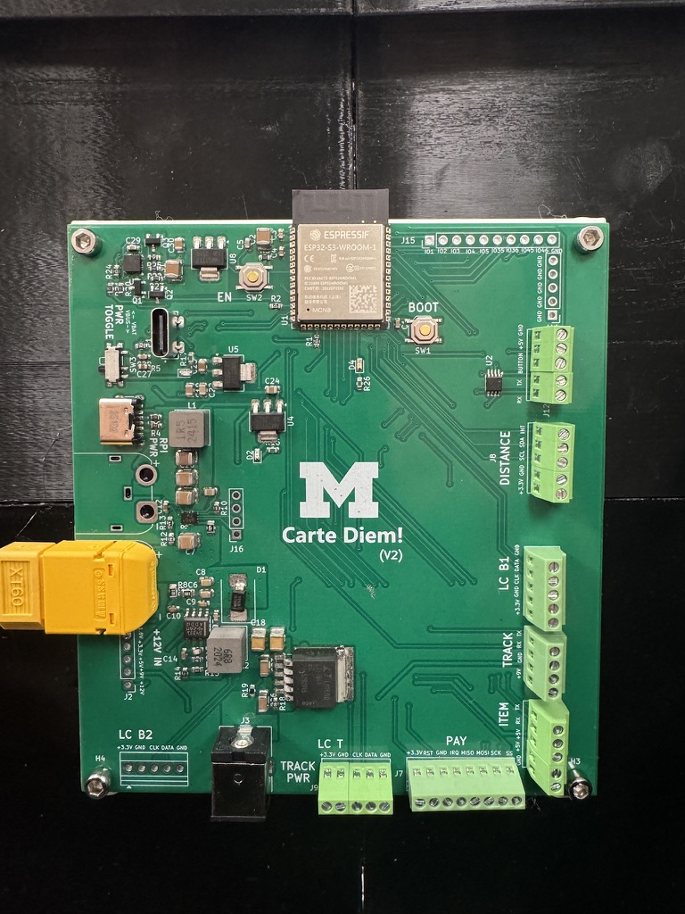
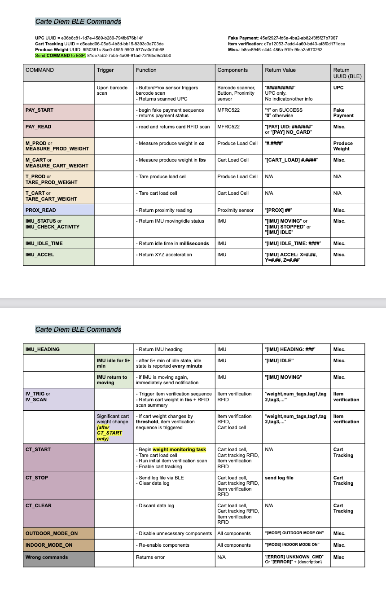

# [Link](https://github.com/cartediem/integration) to original repo
# Carte Diem - System Integration

This repository contains the integrated firmware for the Carte Diem smart shopping cart system. The code integrates all sensors and components involved in the smart shopping cart system and is designed to be flashed onto a custom PCB board powered by the ESP32-S3 microcontroller.

For the PCB design files, see the [Carte Diem PCB KiCad Repository](https://github.com/cartediem/PCB-Design) 

## Table of Contents
- [Hardware Setup](#hardware-setup)
- [Build and Configuration](#build-and-configuration)
- [Configuration Settings](#configuration-settings)
- [BLE Communication](#ble-communication)

## Hardware Setup

### Custom PCB
Use the following custom PCB to flash this repository code:



## Build and Configuration

### ESP-IDF Version
This project is built using **ESP-IDF v5.5.1**. Ensure you have the correct version installed and configured before building.

### Building the Project
```bash
idf.py build
idf.py flash
idf.py monitor
```

**Note:** You may need to configure the project using `idf.py menuconfig` to:
- Enable **BLE NimBLE** stack (Component config → Bluetooth → Enable Bluetooth → NimBLE)
- Configure **partitions.csv** settings (Partition Table configuration)

## Configuration Settings

All configurable settings are defined in [main/cartediem_defs.h](main/cartediem_defs.h). Modify these values to customize the behavior of the system.

### 1. Enable Functionalities
Set to `1` to enable or `0` to disable:

```c
#define ENABLE_LED_DEBUG_STARTUP 1
#define ENABLE_ITEM_VERIFICATION 1
#define ENABLE_CART_TRACKING 1
#define ENABLE_WEIGHT_MONITORING 1
#define ENABLE_PROXIMITY_SENSOR 1
```

### 2. Adjustable Parameters

```c
#define BUTTON_COOLDOWN_MS 1000             // Button press cooldown time
#define PROX_COOLDOWN_MS 1000               // Proximity interrupt cooldown time
#define PROXIMITY_THRESHOLD 30              // Proximity sensor threshold value

// 2.1. RTOS PERIODIC TASK PARAMETERS
#define IV_TASK_PRIORITY 8
#define IV_WEIGHT_MONITOR_INTERVAL_MS 5000  // Interval to monitor weight changes for Item Verification
#define IV_MAX_MOVING_THRESHOLD 0.2f        // Maximum IMU moving threshold to trigger item verification in response to weight change
#define WEIGHT_CHANGE_THRESHOLD_LBS 0.01f   // Threshold (in lbs) to trigger Item Verification

#define IMU_TASK_PRIORITY 7
#define IMU_MONITOR_INTERVAL_MS 5000        // 5 seconds
#define IMU_IDLE_TIME_MINUTES 5             // 1 minutes
#define IMU_MOVING_THRESHOLD 0.03f          // Threshold (in g) to consider IMU as moving

#define CT_TASK_PRIORITY 5
#define CART_TRACKING_INTERVAL_MS 10000     // 10 seconds

// 2.2. PAYMENT PARAMETERS
#define AUTHORIZED_UID {0x1A, 0x83, 0x26, 0x03, 0xBC}
#define AUTHORIZED_UID_LEN 5
```

### 3. Pin Definitions

```c
#define USING_DEVKIT 0  // 0 = Custom PCB, 1 = ESP Devkit
```

Select your hardware platform by setting `USING_DEVKIT` accordingly.

## BLE Communication

Refer to the [Carte Diem BLE Commands PDF](docs/Carte%20Diem%20BLE%20Commands.pdf) for detailed documentation on all available BLE commands and protocol specifications.



### Quick Testing with BLE Apps
For rapid testing and debugging of BLE functionality, you can use:
- **nRF Connect** (iOS/Android) - Provides a user-friendly interface for scanning, connecting, and sending BLE commands
- Other compatible BLE testing applications

Simply connect to the Carte Diem device and use the commands documented in the BLE Commands PDF.
